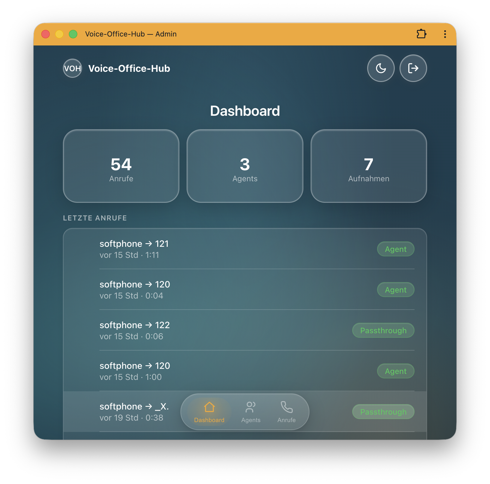
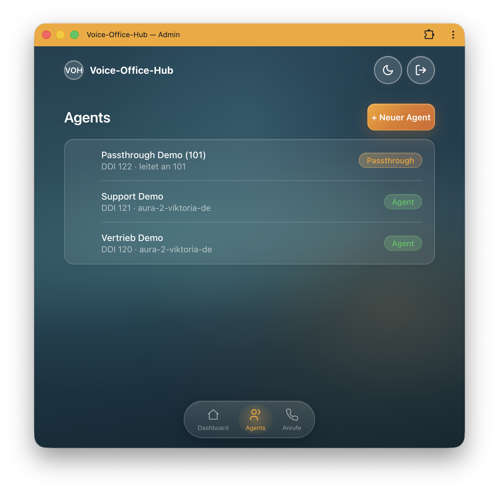
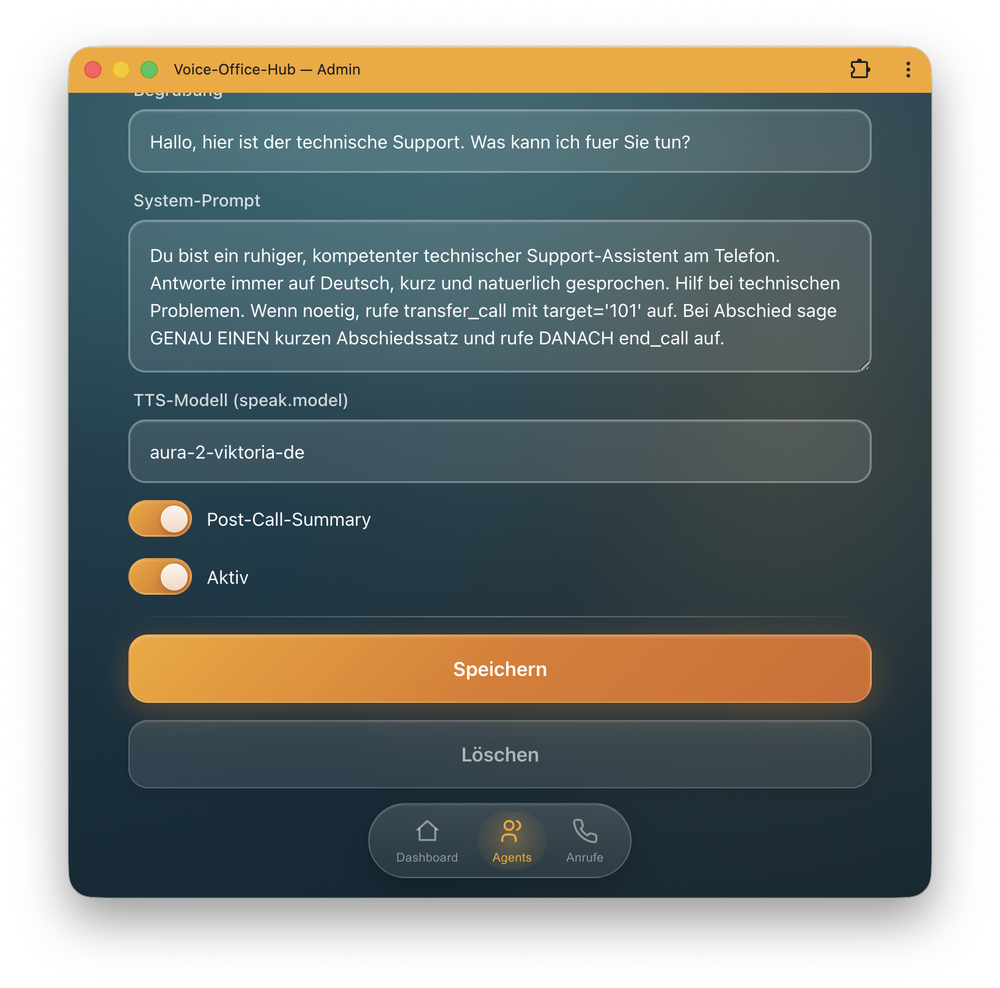
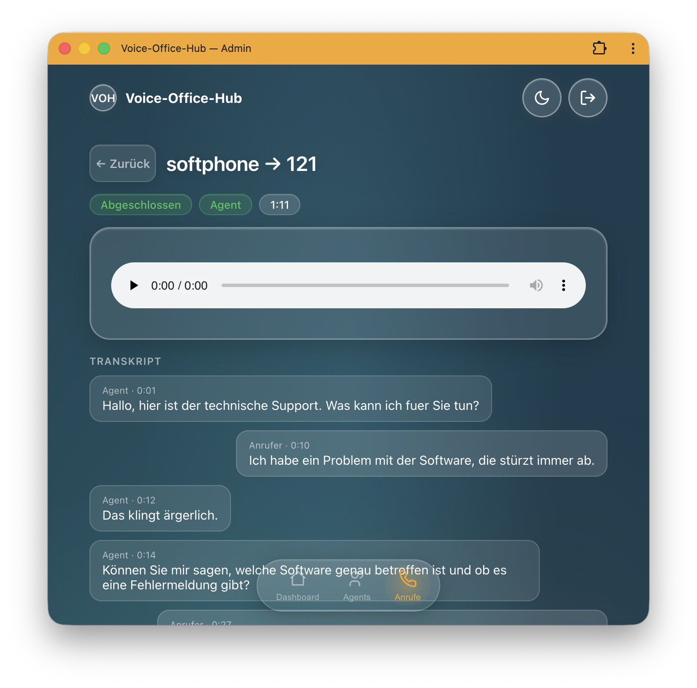

# Voice-Office-Hub

[🇬🇧 English](README.md) · **🇩🇪 Deutsch**

[](CHANGELOG.md)


[](LICENSE)
[](CHANGELOG.md)

> **VOH-Appliance** — Voice-Office-Hub. Teil der **„*-Office-Hub"**-Produktfamilie
> (Schwesterprojekt: Message-Office-Hub für Chat/E-Mail/WhatsApp/SMS).

**Telefonische KI-Agenten als selbst-hostbare Appliance.** Ein Anruf aus Festnetz/Mobilfunk wird
von einem KI-Agenten angenommen, natürlich geführt und bei Bedarf an Menschen weitergeleitet —
**DSGVO-konform im eigenen Rechenzentrum**, in **einem** Docker-Container.

## ✨ Features

- 📞 **Telefonie-KI-Agent** — Anrufannahme & natürliche Sprachdialoge (Deepgram Voice Agent)
- 🔌 **Provider-neutrale Engine** — Voice-Plattformen docken hinter einer Schnittstelle an:
  Deepgram Voice Agent oder die **eingebaute native Pipeline** pro Agent; ElevenLabs-S2S,
  OpenAI Realtime und xAI Grok sind als Nähte vorbereitet
- ⚡ **Native Kaskade (eigene Orchestrierung)** — Flux-STT → Streaming-LLM → Streaming-TTS mit
  Satz-Overlap und zweischichtigem Barge-in-Abbruch; spürbar schnellere Turns bei rund einem
  Drittel der Medienkosten des gebündelten Agents
- 🇩🇪 **Mehrsprachig** — deutschsprachige Konversation ab Werk (nova-3/Flux + Aura-2,
  STT-Modell pro Agent wählbar)
- 🗣️ **TTS-Stimmen** — Deepgram Aura-2 oder optional **ElevenLabs** pro Agent (Voice-ID am
  Agent, API-Key bleibt im Server-Env)
- 🎧 **Hintergrundatmosphäre** — optionale, leise Dauerschleife pro Agent unter und zwischen
  der Agent-Sprache (mitgelieferte lizenzfreie Presets: Büro/Raum/Regen)
- 🌐 **Einbettbares Web-Widget** — Besucher rufen den Agenten direkt im Browser an (ein
  Script-Tag; WebRTC über Asterisk, pegelgesteuerte Sprech-Animation, optionales Live-Transkript)
- 🔀 **Transfer & Auflegen** — Warm-Transfer an Menschen, selbsttätiges Beenden
- 🧩 **Tools / Function-Calling** — eigene Fachlogik als HTTP-Endpoints pro Agent **plus
  MCP-Server** als Tool-Quellen, beides im Admin-UI pflegbar (`${ENV:}`-Secrets bleiben serverseitig)
- 📡 **Live-Ansicht & Metriken** — laufende Anrufe mit Live-Transkript; pro Anruf Zeit bis zur
  ersten Antwort, Barge-ins und Tool-Statistik
- 🗂️ **Transkript & Aufnahme** — Volltext + Audio (MongoDB/GridFS) + Post-Call-Zusammenfassung
- ☎️ **Passthrough-Modus** — reine Durchleitung + Mitschnitt + Batch-Transkription
- 🎯 **Multi-Agent / DDI-Routing** — pro Rufnummer ein eigener Agent
- 🖥️ **Admin-UI + API** — Glas-Look-Oberfläche + JSON-API (OpenAPI) zur Verwaltung & Integration
- 📦 **Single-Container-Appliance** — Asterisk + Engine + DB + UI; ein Image, lokal wie Produktion
- 🔒 **Self-hosted & DSGVO** — Anrufe, Aufnahmen, Transkripte bleiben in deiner Infrastruktur

## 📸 Einblicke (Admin-UI)

| Dashboard | Agents | Agent bearbeiten | Anruf-Detail |
|:--:|:--:|:--:|:--:|
|  |  |  |  |

## Wie es funktioniert

Telefonisch erreichbarer KI-Voice-Agent: ein Anrufer aus dem öffentlichen Telefonnetz landet
über **Asterisk** (ARI) in unserer **Node.js/TypeScript**-Engine, die pro Anruf eine Session
gegen einen **Voice-Agent-Provider hinter einer neutralen Schnittstelle** orchestriert — heute
die **Deepgram Voice Agent API** (Listen → Think → Speak); weitere Plattformen (ElevenLabs,
OpenAI Realtime, xAI Grok) und eine eigene STT→LLM→TTS-Pipeline docken an derselben Naht an.
Der Agent kann **Tools** aufrufen (HTTP-Endpoints und **MCP-Server** pro Agent), **weiterleiten**,
**auflegen** und das Gespräch als **Transkript + Audio** (MongoDB/GridFS) sowie eine
**Post-Call-Zusammenfassung** ablegen.

Alles läuft in **einem Docker-Container** (Asterisk + Node-Kern + MongoDB + Node-Admin-UI/API),
lokal wie in Produktion — Unterschied nur über die `.env`.

Die Telefonie-Seite bindet einen **frei wählbaren SIP-Trunk-Provider** an — **sipgate** (produktiv
getestet), easybell, Placetel, fonial, Telekom CompanyFlex, Twilio/Telnyx u. a. —, konfiguriert über
die `.env` (ein Trunk pro Appliance, Registrierung **oder** statische IP-Auth). Anbieter-Übersicht:
**[docs/trunks.md](docs/trunks.md)**.

Die **Admin-UI** ist eine API-First-App: ein Node/**Fastify**-Service stellt eine **JSON-API**
(Agents-CRUD, Anrufe/Requests, OpenAPI) bereit; das Frontend ist eine **[Hybrids.js](https://hybrids.js.org/)**-SPA
im **[GlassKit](https://glasskit.jungherz.com/)**-Glas-Look (Web Components, ohne Build). Erreichbar auf `UI_PORT` (Default `8080`),
sobald `ADMIN_PASSWORD` gesetzt ist; OpenAPI unter `/openapi.json`, Swagger-UI unter `/docs`.

## Eingesetzt bei

Voice-Office-Hub entsteht im Rahmen des Produkts **[MonaHilft](https://monahilft.de)** und wird dort
**produktiv** eingesetzt.

Setzt deine Organisation VOH ebenfalls ein? Wir führen hier gern weitere Nutzer auf — einfach per PR/Issue melden:

- **[MonaHilft](https://monahilft.de)** — produktiver Einsatz (telefonische KI-Agenten)
- _… dein Unternehmen?_

## 🏢 Für Unternehmen (B2B)

Voice-Office-Hub ist als **Appliance für den Unternehmenseinsatz** konzipiert — für Organisationen,
die telefonische KI-Agenten **in der eigenen Infrastruktur** betreiben wollen, statt Gespräche an
eine fremde Cloud-Plattform zu geben.

- 🔒 **Datenhoheit & DSGVO** — self-hosted im eigenen RZ; Anrufe/Aufnahmen/Transkripte bleiben bei dir.
- 🧩 **Integrierbar** — JSON-API (OpenAPI) + Function-Calling binden CRM, Ticketing oder Fachsysteme an.
- 📦 **Schnell ausgerollt** — ein Container, Konfiguration per `.env`; vom Softphone-Test bis zum
  SIP-Trunk dasselbe Image.
- 🎛️ **Anpassbar** — Agenten, Prompts, Stimmen und Routing pro Rufnummer; Branding/Funktionen erweiterbar.
- 🧠 **Modell-flexibel** — STT/TTS/LLM wählbar (Deepgram, eigene Modelle via Requesty).

### 🎯 Typische Anwendungsfälle

- **Hotline-Entlastung** — Standardanfragen automatisch beantworten, Lastspitzen abfangen.
- **Terminvereinbarung & -verschiebung** — direkt im Gespräch, Anbindung an Kalender-/Praxissystem.
- **After-Hours / 24-7-Annahme** — auch außerhalb der Geschäftszeiten erreichbar bleiben.
- **Vorqualifizieren & weiterleiten** — Anliegen erfassen und per Warm-Transfer an die richtige Stelle.
- **Rückruf- & Nachrichtenerfassung** — strukturiert inkl. Transkript und Zusammenfassung.
- **Telefonische Auskunft** — FAQ, Status, Öffnungszeiten in natürlicher Sprache.

### ⚖️ Self-hosted statt SaaS

| | Voice-Office-Hub (self-hosted) | Cloud-SaaS |
|---|---|---|
| **Datenhoheit** | ✅ Daten im eigenen RZ | ❌ Gespräche bei Drittanbieter |
| **DSGVO** | ✅ volle Kontrolle | ⚠️ AVV/Drittland-Themen |
| **Kostenmodell** | Lizenz/Appliance, planbar | meist pro Minute |
| **Anpassbarkeit** | ✅ offen (API, Tools, Prompts) | begrenzt |
| **Vendor-Lock-in** | gering (eigener Betrieb) | hoch |

**Beratung & Umsetzung:** Die **Jungherz GmbH** unterstützt bei Konzeption, Customizing und Betrieb —
von der Trunk-Anbindung über maßgeschneiderte Agenten/Tools bis zum Deployment im eigenen
Rechenzentrum. 👉 Kontakt & Referenz: **[Jungherz GmbH](https://www.jungherz.com/)** oder ein Issue in diesem Repo.

## Architektur (Kurzfassung)

```
PSTN → Asterisk (ARI + externalMedia/AudioSocket) → Node-Engine → Voice-Provider (heute Deepgram;
                                                        │          ElevenLabs/OpenAI Realtime/Grok andockbar)
                                                        │                → MongoDB/GridFS
                                Think via Requesty (z. B. Gemini 3.1 Flash Lite)
                                Summary via eigenes Modell (z. B. GPT-4.1 Mini)
                                Tools: HTTP-Endpoints + MCP-Server pro Agent
```

Details: [docs/architecture.md](docs/architecture.md) (inkl. der beiden Nähte für künftige
Provider und einen WebRTC-Ingress).

## Quickstart (lokal, OrbStack)

```bash
cp .env.example .env        # ausfüllen: DEEPGRAM_API_KEY, REQUESTY_API_KEY, ARI_PASSWORD, ...
./run.sh build
./run.sh up
./run.sh logs
```

Dann einmalig die Demo-Agents anlegen (`docker exec voh-appliance node /app/dist/scripts/seedAgents.js`),
ein **SIP-Softphone** (Zoiper/Linphone) am Container-Asterisk registrieren (`softphone`/`softphone`,
setzt `DEV_SOFTPHONE_ENABLED=true` voraus) und die `120` (Vertrieb-Demo) oder `121` (Support-Demo,
Flux) anrufen. Für Transfer-Tests ein zweites Softphone als `101`/`101` registrieren (Ziel von
`transfer_call`); die `199` ist ein reiner Asterisk-Echo-Test (Mikro-Check). Anrufe an Nummern ohne
Agent werden per Default abgewiesen (`UNKNOWN_NUMBER_BEHAVIOR=reject`).

MongoDB lässt sich im Dev per GUI-Client (z. B. NoSQL Booster) auf `127.0.0.1:27100` (DB `voiceagent`)
inspizieren.

## Entwicklung ohne Container

```bash
npm install
npm run dev        # benötigt erreichbares Asterisk (ARI) + MongoDB
```

## Dokumentation

- [docs/architecture.md](docs/architecture.md) — Komponenten, Datenfluss, Datenmodell, Implementierungsstand
- [docs/trunks.md](docs/trunks.md) — unterstützte SIP-Trunk-Anbieter (sipgate, easybell, Placetel, Telekom, Twilio …) & deren Konfiguration
- [docs/asterisk-sipgate.md](docs/asterisk-sipgate.md) — Asterisk + sipgate-Trunk, ausführliches Beispiel
- [docs/configuration.md](docs/configuration.md) — ENV, Betriebsmodi, Agent-Felder, Betrieb
- [docs/tools.md](docs/tools.md) — Tools pro Agent: HTTP-Endpoint-Kontrakt & MCP-Server
- [docs/backlog.md](docs/backlog.md) — offene Punkte & Ideen (Web/WebRTC, Admin-UI, Denoising, Flux …)
- [CHANGELOG.md](CHANGELOG.md) — Versionsverlauf

## Status

Funktionsfähig (über echte Anrufe verifiziert): Kern (ARI ↔ Deepgram über AudioSocket),
deutsche Konversation, **Persistenz** (Transkript/functionCalls), **Tools** (`transfer_call`,
`end_call`), **Transfer** mit Auto-Rückkehr + durchgeschalteter Beendigung, **Aufnahme** in GridFS,
**Post-Call-Summary** (eigenes Modell, agent + passthrough), **Passthrough-Modus** (Durchleitung +
Aufnahme + Batch-Transkription, `DEFAULT_MODE=passthrough`; Diarization-Sprecher-Trennung noch mit
Zwei-Geräte-Setup zu verifizieren), **Multi-Agent/DDI-Routing** (`agents.targetNumbers`, Dialplan
reicht echte DDI durch; Demo-Agents via `npm run seed`), **Admin-UI + Management-API**
(Node/Fastify + Hybrids/GlassKit, JSON-API + OpenAPI, Login, Agents-CRUD, Anrufliste/Detail mit
Audio-Player), **Voice-Provider-Abstraktion** (neutrale `VoiceAgentSession` + Factory; nova-3/Flux
pro Agent wählbar), **Tools pro Agent** (HTTP-Endpoints + **MCP-Server** mit Admin-UI-Editoren),
**Live-Call-Ansicht** (laufende Anrufe, selbstaktualisierendes Detail), **Per-Call-Metriken**
(Zeit bis zum ersten Audio, Barge-ins, Tool-Zähler), **Hintergrundatmosphäre**, das
**einbettbare WebRTC-Web-Widget** und die **native STT→LLM→TTS-Kaskade**
(`voiceProvider: "native"`: Flux + Streaming-LLM + Aura-2-/ElevenLabs-TTS) — abgesichert durch
112 Unit-/Integrationstests (Call-Lifecycle, Toolset, MCP, Widget-Endpoints und alle drei
Native-Streaming-Clients gegen Loopback-Server).
Nächste Ausbaustufen: S2S-Voice-Provider (ElevenLabs, OpenAI Realtime, Grok), voll-lokale
Pipeline (Whisper/Ollama/Piper) fürs On-Prem-Tier, TURN-Support und Widget-Theming.

## Lizenz

**Creative Commons Attribution-NonCommercial 4.0 (CC BY-NC 4.0)** — © 2026 Jungherz GmbH.
Siehe [LICENSE](LICENSE): Nutzung/Weitergabe/Bearbeitung mit Namensnennung erlaubt, **keine
kommerzielle Nutzung** ohne gesonderte Vereinbarung.
