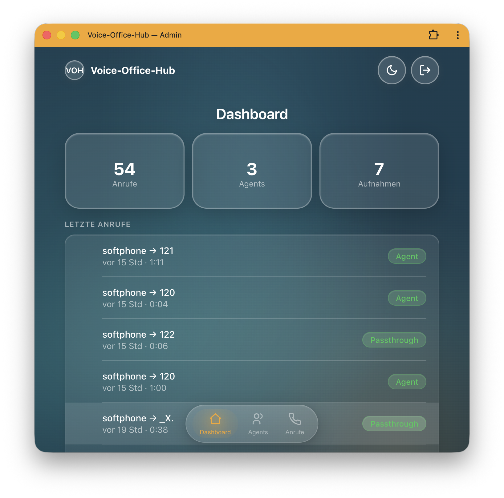
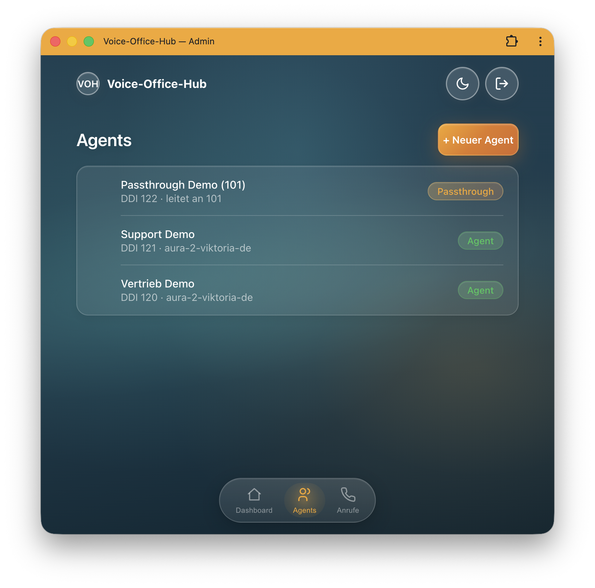
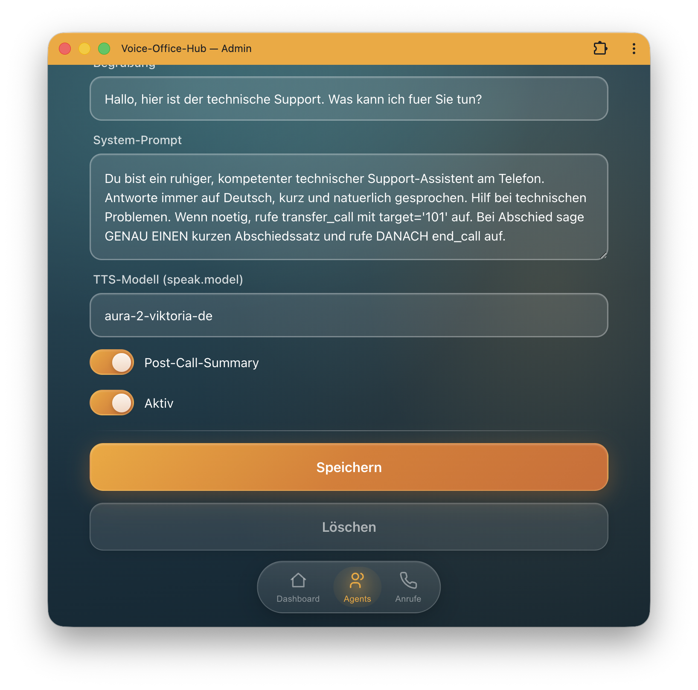
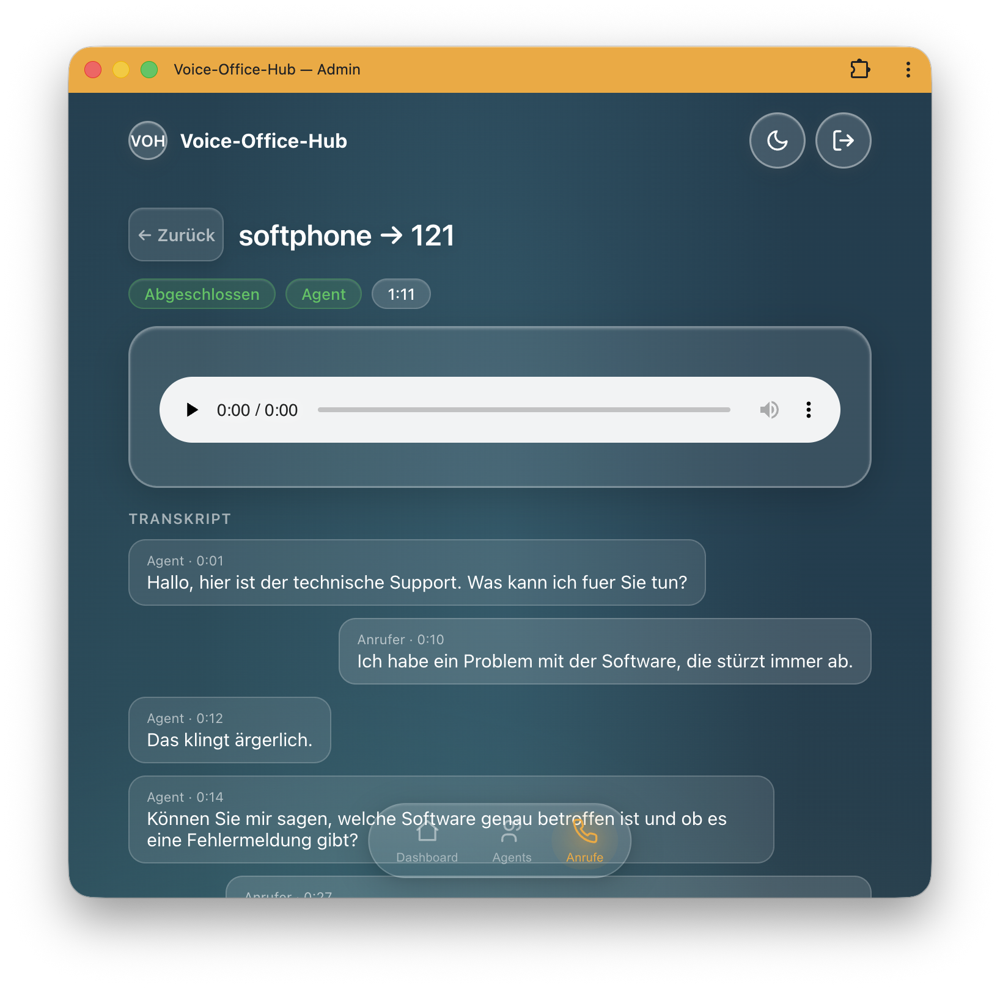

# Voice-Office-Hub

**🇬🇧 English** · [🇩🇪 Deutsch](README.de.md)

[](CHANGELOG.md)


[](LICENSE)
[](CHANGELOG.md)

> **VOH-Appliance** — Voice-Office-Hub. Part of the **"*-Office-Hub"** product family
> (sister project: Message-Office-Hub for chat/email/WhatsApp/SMS).

**AI phone agents as a self-hostable appliance.** A call from landline/mobile is answered by an
AI agent, handled naturally, and handed off to a human when needed — **GDPR-compliant in your own
data center**, in a **single** Docker container.

## ✨ Features

- 📞 **Telephony AI agent** — answers calls over SIP and holds a natural voice conversation
- 🔌 **Provider-neutral engine** — voice platforms dock behind one interface: Deepgram Voice
  Agent or the **built-in native pipeline** per agent; ElevenLabs S2S, OpenAI Realtime and
  xAI Grok are prepared seams
- ⚡ **Native cascade (own orchestration)** — Flux STT → streaming LLM → streaming TTS with
  sentence overlap and two-layer barge-in cancellation; noticeably snappier turns and roughly
  a third of the bundled agent's media cost
- 🇩🇪 **Multilingual** — German-language conversation out of the box (nova-3/Flux + Aura-2,
  STT model selectable per agent)
- 🗣️ **TTS voices** — Deepgram Aura-2, **Mistral Voxtral** (EU processing, ~7× cheaper than
  ElevenLabs, voice cloning from ~3 s of reference audio) or **ElevenLabs** per agent — picked
  from a server-side catalogue that also carries the GDPR classification. API keys stay in the
  server env, never in the database
- 🎧 **Background ambience** — optional per-agent room tone under and between agent speech
  (bundled license-free presets: office/room/rain)
- 🌐 **Embeddable web widget** — visitors call the agent right in the browser (one script
  tag; WebRTC via Asterisk, level-driven speaking animation, optional live transcript)
- 🔀 **Transfer & hang-up** — warm transfer to humans, autonomous call ending
- ⏳ **No dead air** — a short filler phrase while a slow tool is working; follow-up prompts when
  the caller goes quiet (escalating, optionally ending in an automatic hang-up — abandoned calls
  end instead of running up the line)
- 🌍 **Announcements translated automatically** — you maintain each announcement **once** in your
  own language; if the caller switches languages, the engine translates them at runtime — keeping
  the level of formality used in the conversation
- 👋 **Greeting in the caller's language** — the agent remembers which language a number spoke and
  greets it that way next time, before a single word is said; phone numbers are stored
  pseudonymised and expire on their own (opt-in per agent)
- 🧩 **Tools / function calling** — per-agent HTTP endpoints for your business logic **plus
  MCP servers** as tool sources, both managed in the admin UI (`${ENV:}` secrets stay server-side)
- 📡 **Live view & metrics** — running calls with live transcript; per-call time-to-first-answer,
  barge-ins, and tool stats
- 🗂️ **Transcript & recording** — full text + audio (MongoDB/GridFS) + post-call summary
- ☎️ **Passthrough mode** — pure forwarding + recording + batch transcription
- 🎯 **Multi-agent / DDI routing** — a dedicated agent per phone number
- 🖥️ **Admin UI + API** — glass-look interface + JSON API (OpenAPI) for management & integration
- 📦 **Single-container appliance** — Asterisk + engine + DB + UI; one image, local as in production
- 🔒 **Self-hosted & GDPR** — calls, recordings, transcripts stay in your infrastructure

## 📸 Glimpses (Admin UI)

| Dashboard | Agents | Edit agent | Call detail |
|:--:|:--:|:--:|:--:|
|  |  |  |  |

## How it works

A phone-reachable AI voice agent: a caller from the public telephone network arrives via
**Asterisk** (ARI) in our **Node.js/TypeScript** engine, which orchestrates one session per call
against a **voice-agent provider behind a neutral interface** — today the **Deepgram Voice Agent
API** (Listen → Think → Speak); further platforms (ElevenLabs, OpenAI Realtime, xAI Grok) and an
own STT→LLM→TTS pipeline dock onto the same seam. The agent can call **tools** (per-agent HTTP
endpoints and **MCP servers**), **transfer**, **hang up**, and store the conversation as a
**transcript + audio** (MongoDB/GridFS) as well as a **post-call summary**.

Everything runs in a **single Docker container** (Asterisk + Node core + MongoDB + Node admin
UI/API), local as in production — the only difference is the `.env`.

The telephony side connects to a **freely selectable SIP trunk provider** — **sipgate** (tested in
production), easybell, Placetel, fonial, Telekom CompanyFlex, Twilio/Telnyx, and more — configured
via `.env` (one trunk per appliance, registration **or** static-IP auth). See the provider overview
in **[docs/trunks.md](docs/trunks.md)**.

The **admin UI** is an API-first app: a Node/**Fastify** service exposes a **JSON API**
(agents CRUD, calls/requests, OpenAPI); the frontend is a **[Hybrids.js](https://hybrids.js.org/)** SPA
in the **[GlassKit](https://glasskit.jungherz.com/)** glass look (Web Components, no build step). Available on `UI_PORT` (default `8080`)
once `ADMIN_PASSWORD` is set; OpenAPI at `/openapi.json`, Swagger UI at `/docs`.

## Used by

Voice-Office-Hub is being built as part of the **[MonaHilft](https://monahilft.de)** product and is
used there **in production**.

Is your organization using VOH too? We're happy to list additional users here — just let us know via PR/issue:

- **[MonaHilft](https://monahilft.de)** — production use (AI phone agents)
- _… your company?_

## 🏢 For companies (B2B)

Voice-Office-Hub is designed as an **appliance for enterprise use** — for organizations that want to
run AI phone agents **in their own infrastructure** instead of handing conversations to a third-party
cloud platform.

- 🔒 **Data sovereignty & GDPR** — self-hosted in your own data center; calls/recordings/transcripts stay with you.
- 🧩 **Integratable** — JSON API (OpenAPI) + function calling connect CRM, ticketing, or business systems.
- 📦 **Quick to roll out** — one container, configuration via `.env`; from softphone test to
  SIP trunk, the same image.
- 🎛️ **Customizable** — agents, prompts, voices, and routing per phone number; branding/features extensible.
- 🧠 **Model-flexible** — STT/TTS/LLM selectable (Deepgram, your own models via Requesty).

### 🎯 Typical use cases

- **Hotline relief** — answer standard inquiries automatically, absorb load spikes.
- **Appointment scheduling & rescheduling** — right within the call, connected to calendar/practice systems.
- **After-hours / 24-7 answering** — stay reachable outside business hours.
- **Pre-qualify & route** — capture the request and warm-transfer it to the right place.
- **Callback & message capture** — structured, including transcript and summary.
- **Phone information** — FAQ, status, opening hours in natural language.

### ⚖️ Self-hosted instead of SaaS

| | Voice-Office-Hub (self-hosted) | Cloud SaaS |
|---|---|---|
| **Data sovereignty** | ✅ data in your own data center | ❌ conversations at a third party |
| **GDPR** | ✅ full control | ⚠️ DPA/third-country concerns |
| **Cost model** | license/appliance, predictable | mostly per minute |
| **Customizability** | ✅ open (API, tools, prompts) | limited |
| **Vendor lock-in** | low (self-operated) | high |

**Consulting & implementation:** **Jungherz GmbH** supports with conception, customizing, and
operations — from trunk integration through tailored agents/tools to deployment in your own data
center. 👉 Contact & reference: **[Jungherz GmbH](https://www.jungherz.com/)** or open an issue in this repo.

## Architecture (short version)

```
PSTN → Asterisk (ARI + externalMedia/AudioSocket) → Node engine → Voice provider (Deepgram today;
                                                        │          ElevenLabs/OpenAI Realtime/Grok dockable)
                                                        │                → MongoDB/GridFS
                                Think via Requesty (e.g. Gemini 3.1 Flash Lite)
                                Summary via dedicated model (e.g. GPT-4.1 Mini)
                                Tools: per-agent HTTP endpoints + MCP servers
```

Details: [docs/architecture.md](docs/architecture.md) (incl. the two seams for future providers
and a WebRTC ingress).

## Quickstart (local, OrbStack)

```bash
cp .env.example .env        # fill in: DEEPGRAM_API_KEY, REQUESTY_API_KEY, ARI_PASSWORD, ...
./run.sh build
./run.sh up
./run.sh logs
```

Then create the demo agents once (`docker exec voh-appliance node /app/dist/scripts/seedAgents.js`),
register a **SIP softphone** (Zoiper/Linphone) with the container's Asterisk (`softphone`/`softphone`,
requires `DEV_SOFTPHONE_ENABLED=true`) and call `120` (sales demo) or `121` (support demo, Flux).
For transfer tests, register a second softphone as `101`/`101` (target of `transfer_call`); `199` is
a pure Asterisk echo test (mic check). Calls to numbers without an agent are rejected by default
(`UNKNOWN_NUMBER_BEHAVIOR=reject`).

In dev, MongoDB can be inspected via a GUI client (e.g. NoSQL Booster) at `127.0.0.1:27100` (DB `voiceagent`).

## Development without a container

```bash
npm install
npm run dev        # requires a reachable Asterisk (ARI) + MongoDB
```

## Documentation

- [docs/architecture.md](docs/architecture.md) — components, data flow, data model, implementation status (in German)
- [docs/trunks.md](docs/trunks.md) — supported SIP trunk providers (sipgate, easybell, Placetel, Telekom, Twilio …) & how to configure them (in German)
- [docs/asterisk-sipgate.md](docs/asterisk-sipgate.md) — Asterisk + sipgate trunk, worked example (in German)
- [docs/configuration.md](docs/configuration.md) — ENV, operating modes, agent fields, operations (in German)
- [docs/tools.md](docs/tools.md) — per-agent tools: HTTP endpoint contract & MCP servers (in German)
- [docs/tts-provider.md](docs/tts-provider.md) — TTS engines: selection, cost, GDPR/EU residency, voice migration (in German)
- [docs/backlog.md](docs/backlog.md) — open items & ideas (Web/WebRTC, admin UI, denoising, Flux …) (in German)
- [CHANGELOG.md](CHANGELOG.md) — version history
- [README.de.md](README.de.md) — full German version of this README

## License

**Creative Commons Attribution-NonCommercial 4.0 (CC BY-NC 4.0)** — © 2026 Jungherz GmbH.
See [LICENSE](LICENSE): use/distribution/adaptation with attribution permitted, **no commercial
use** without a separate agreement.
